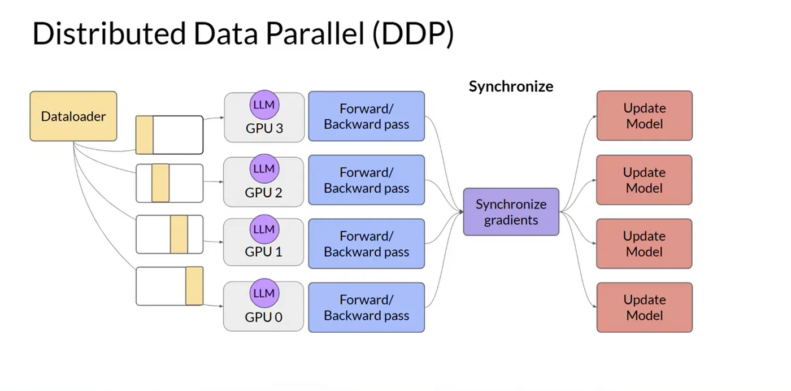

# Distributed training

**I have spoken with Dr. Swany for my project**

> Deven Mistry, <demistry@iu.edu>
>
> This article talks about distributed training in PyTorch

## ddp

1. constructing the DDP module
2. forward pass
3. backward pass
4. optimizer states

### things to talk about

1. processgroup c10d
    1. `ProcessGroup` manages the communication between different processes participating in distributed training. It handles operations like `all_reduce`, `broadcast`, `scatter`, etc.
2. backend type "gloo", "nccl", etc
    1. `nccl` — Optimized for NVIDIA GPUs, recommended for multi-GPU setups.
    2. `gloo` — CPU and GPU compatible, often used for multi-node training when GPUs aren't available.
    3. `mpi` — Uses the MPI library for communication (less commonly used nowadays).
3. data distribution using the `DistributedSampler`
    1. Ensures each process gets a unique, non-overlapping subset of the data.
    2. Typically used with a `DataLoader` to evenly split and shuffle the dataset.
4. Major piece: gradient synchronization
    1. The core of DDP.
    2. During the backward pass, gradients are averaged across all GPUs using an **all-reduce** operation.
    3. Synchronization happens automatically when `.backward()` is called on the loss.
5. when to use this?
    1. ideally when your model fits entirely on a single GPU
    2. used in cases when you have a lot of data, that you can split across multiple GPUs

### advantages

1. shards data across the `N` GPUs.
2. not limited to using multiple GPUs on a single node, it will also work on multiple GPUs across multiple nodes

### disadvantages

1. creates multiple copies of the model across the `N` gpus
2. redundant use of memory because of multiple copies of the model, way to overcome this is with sharding

### links

1. [overview from the korean site](https://tutorials.pytorch.kr/beginner/dist_overview.html#:~:text=Collective%20Communication%20(c10d)%20library%20supports,e.g.%2C%20send%20and%20isend).)
2. [ddp tutorial](https://pytorch.org/tutorials/intermediate/ddp_tutorial.html)
3. [ddp notes](https://pytorch.org/docs/stable/notes/ddp.html)
4. [medium article](https://medium.com/@yashdoza21/scaling-model-training-across-multiple-gpus-efficient-strategies-with-pytorch-ddp-and-fsdp-d744be462667)

## fsdp

> **Note:** I might not cover FSDP because it introduces additional complexity — involving sharding policies, parameter scattering, optimizer state partitioning, and advanced collective operations like `ReduceScatter`. It’s a powerful approach but deserves its own dedicated explanation.
